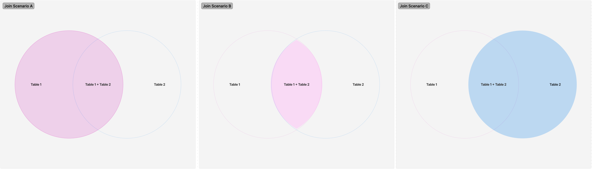
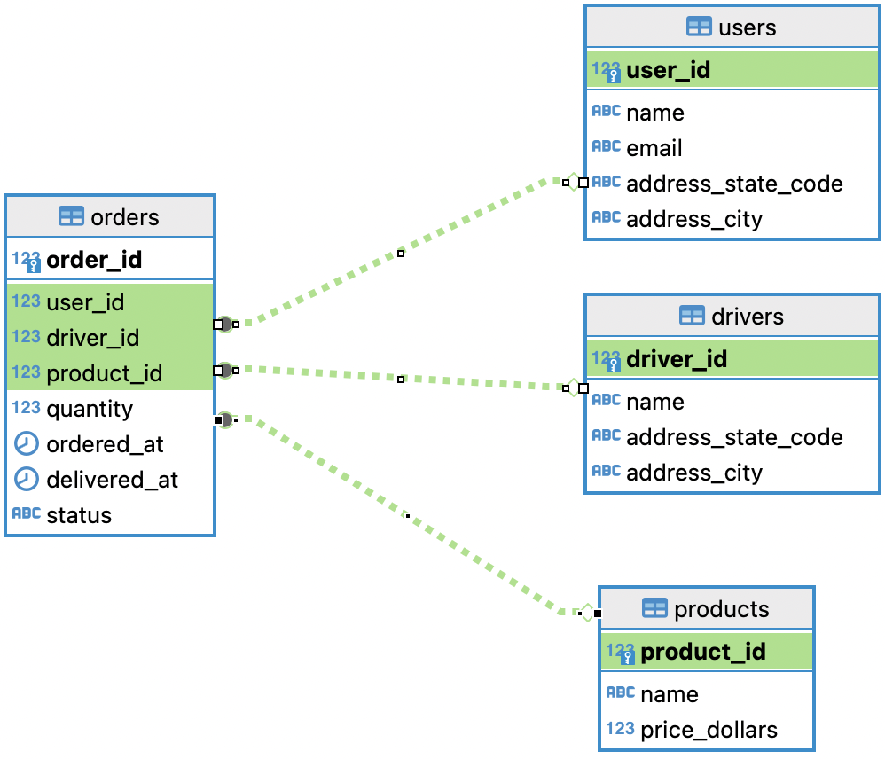

<h1 align="center">Curri Data Engineering Internship Take Home Assignment</h1>

<p align="center">
  <a href="" rel="noopener">
  </a>
</p>

<p align="center"> A take home assignment of SQL exercises for summer 2024 internship candidates </p>
    <br> 
</p>

## 📝 Table of Contents

* [📝 Table of Contents](#-table-of-contents-)
* [🧐 About](#-about-)
* [❗ Prerequisites](#-prerequisites-)
* [🧰 Setup](#-setup-)
* [🏁 Getting Started](#-getting-started-)
* [🚀 Submission](#-submission-)
* [🏋️ Exercises](#-exercises-)
* [🗂️ ERD](#-erd-)


## 🧐 About <a name = "about"></a>

This repository contains a take home assignment of SQL exercises for summer 2024 internship candidates. The assignment is divided into 2 parts:

1. SQL Exercises -- Write SQL queries to solve the exercises
2. SQL Theory -- Short answer theoretical questions about SQL and databases

The exercises are designed to test the candidate's SQL knowledge and problem solving skills. The candidate is expected to solve the exercises and submit the solutions in a SQL file.

## ❗ Prerequisites <a name = "prerequisites"></a>

Before you begin the setup section (below), you will need to have access to or create a new a GitHub account.

## 🧰 Setup <a name = "setup"></a>

To complete the assignment, you will need to have the following installed:
1. [Docker Desktop](https://www.docker.com/products/docker-desktop)
2. [DBeaver (Community/Open Source Version)](https://dbeaver.io/download/) (or another SQL client of your choice)
3. [Git](https://git-scm.com/downloads)


## 🏁 Getting Started <a name = "getting-started"></a>

### Step 1: Clone the Repository
Open your terminal and run the following command to clone the repository to your local machine:

```bash
git clone https://github.com/teamcurri/sql-exercises.git
```

### Step 2: Make sure Docker is running
Open Docker Desktop and make sure it is running. If it is not running, start it.

To check if Docker is running, you can run the following command in your terminal:

```bash
docker info
```

You should see information about your Docker installation if it is running, something like this:

```
Client:
 Version:    26.0.0
 Context:    desktop-linux
 Debug Mode: false
 Plugins:
  buildx: Docker Buildx (Docker Inc.)
  ...
```

### Step 3: Start the Database
Navigate to the repository directory (in the same terminal window)

```bash
cd sql-exercises
```

Run the following command to start the database:

```bash
docker-compose up -d
```

This might take a few minutes to create and populate the database.

### Step 4: Connect to the Database
Open DBeaver (or another SQL client of your choice) and connect to the database using the following credentials:

```bash
host=localhost
port=5432
database=curri-practice-db
user=curri
```

### Step 5: Connecting to the Database and Writing Queries

Connecting to the Database:


https://github.com/teamcurri/sql-exercises/assets/62448274/619ff1d6-b701-4fc6-be07-e7dec3e7f66a


Writing Queries:


https://github.com/teamcurri/sql-exercises/assets/62448274/a29a4cfc-b216-4b55-98a4-859d8ee680d9


### Step 6: Complete the Exercises

For the coding exercises, write out all of your SQL queries in a single file called `{first_name}_{last_name}_sql_exercise_submission.sql`. You can use DBeaver or another SQL client to write and execute/test your queries.

Please make sure to include a semi-colon `;` at the end of each query.

For the short answer questions, write out your answers in a text file called `{first_name}_{last_name}_sql_theory_submission.txt` and make sure to include the question number before each answer.

## 🚀 Submission <a name = "submission"></a>

To submit your solutions, send over the `{first_name}_{last_name}_sql_exercise_submission.sql` file and the `{first_name}_{last_name}_sql_theory_submission.txt` file as a DM in Slack to **@Nathan Jones**.

If you have any questions or need help with the assignment, please reach out in the `#summer-2024-data-internship` channel on Slack.

Good luck! 🚀

## 🏋️ Exercises <a name = "exercises"></a>

### Theoretical Questions

1. What is a primary key? What is a foreign key? How are they different?

2. What is the difference between the order of execution of the clauses in a SQL query and the order of appearance of the clauses in a SQL query? (`SELECT`, `FROM`, `WHERE`, `GROUP BY`, `ORDER BY`)

3. Briefly explain what a `LEFT JOIN` is, a `RIGHT JOIN` is, and an `INNER JOIN` is. Match each of these join types with the correct Venn diagram representation below.



4. What is a "one-to-many" relationship?

5. Your friend Nathan is telling you that he joined the `orders` onto the `drivers` table using each table's `driver_id` column. Nathan can't figure out why he is seeing multiple entries for the same driver in his result set. How would you explain the issue to Nathan?

### Coding Exercises

**Note**: The *Expected Output* for exercises without a sorting will not match your output exactly (which is fine). The expected output is just a sample of what the output should look like. The *Expected Output* for exercises with sorting will match your output exactly.

Question 1. List all orders with their associated id, order times, product names, quantities, and order statuses. Sort the list so the oldest orders appear first.

Expected Output:

|   order_id | ordered_at                       | name           |   quantity | status    |
|-----------:|:---------------------------------|:---------------|-----------:|:----------|
|      12915 | 2024-01-01 00:01:41.337870+00:00 | Burrito        |          5 | Delivered |
|       9650 | 2024-01-01 00:06:21.770494+00:00 | Sandwich       |          4 | Pending   |
|       8149 | 2024-01-01 00:15:14.710452+00:00 | Fish and Chips |          2 | Delivered |
|       4191 | 2024-01-01 00:16:27.213067+00:00 | Tacos          |          2 | Delivered |
|      14314 | 2024-01-01 00:16:33.258738+00:00 | Curry          |          4 | Delivered |
| ...        | ...                              | ...            |        ... | ...       |

Question 2. Find the total number of orders for each user that has placed an order. Include the user's id, name, and the total number of orders. Sort the results by the user's with the most orders. Name the columns user_id, user_name, and total_orders.

Expected Output:

|   user_id | user_name      |   total_orders |
|----------:|:---------------|---------------:|
|       146 | Jennifer Price |             95 |
|        88 | Tracey Reilly  |             95 |
|       110 | Jaime Brown    |             94 |
|       177 | Hector Paul    |             92 |
|        35 | Samuel Warren  |             90 |
| ...       | ...            |            ... |


Question 3. Calculate the total revenue generated by each product, sorted by revenue. Name the columns product_name and total_revenue.

Expected Output:

| product_name | total_revenue |
| :----------- | ------------: |
| Curry        |        115757 |
| Burger       |       89901.4 |
| Sandwich     |       41275.4 |
| Burrito      |       39769.9 |
| Tacos        |       33548.2 |
| ...          |           ... |


Question 4. List All Products with Latest Delivery Date or Default Message. Name the columns product_name and latest_delivery_date.

Expected Output:

| product_name   | latest_delivery_date             |
|:---------------|:---------------------------------|
| Burger         | 2024-05-04 13:29:38.210522+00:00 |
| Vegan Bowl     | 2024-05-04 09:14:12.184154+00:00 |
| Curry          | 2024-05-04 13:12:49.369799+00:00 |
| Burrito        | 2024-05-04 00:01:35.217110+00:00 |
| Pasta          | 2024-05-04 05:21:51.304887+00:00 |
| ...            | ...                              |

Question 5. Find the number of orders each driver has been assigned to. If there are drivers that have not been assigned to a delivery, make sure they show up and have 0 for their order count.

Expected Output:

|   driver_id | name            |   order_count |
|------------:|:----------------|--------------:|
|          23 | John Pierce     |           609 |
|          11 | Amy Underwood   |           557 |
|          24 | Melissa Marquez |           614 |
|           8 | Jamie Chavez    |           594 |
|          19 | Ashley Garrett  |           627 |
| ...         | ...             |           ... |

Question 6. Calculate the average time to complete a delivery (in hours) for orders that have been delivered.

Expected Output:

|   average_delivery_hours |
|-------------------------:|
|                  12.4987 |

Question 7. Show the total orders and total pending orders for each city where drivers are based.

Expected Output:

| address_city   |   total_orders |   pending_orders |
|:---------------|---------------:|-----------------:|
| Riceside       |            589 |               35 |
| Lake Curtis    |            621 |               32 |
| Lake Mark      |            578 |               28 |
| Traciebury     |            617 |               29 |
| East Nathaniel |            627 |               23 |


## 🗂️ ERD <a name = "erd"></a>

Here is the Entity Relationship Diagram (ERD) for the practice database. You can use this to understand the relationships between the tables and it will help you write your queries.


