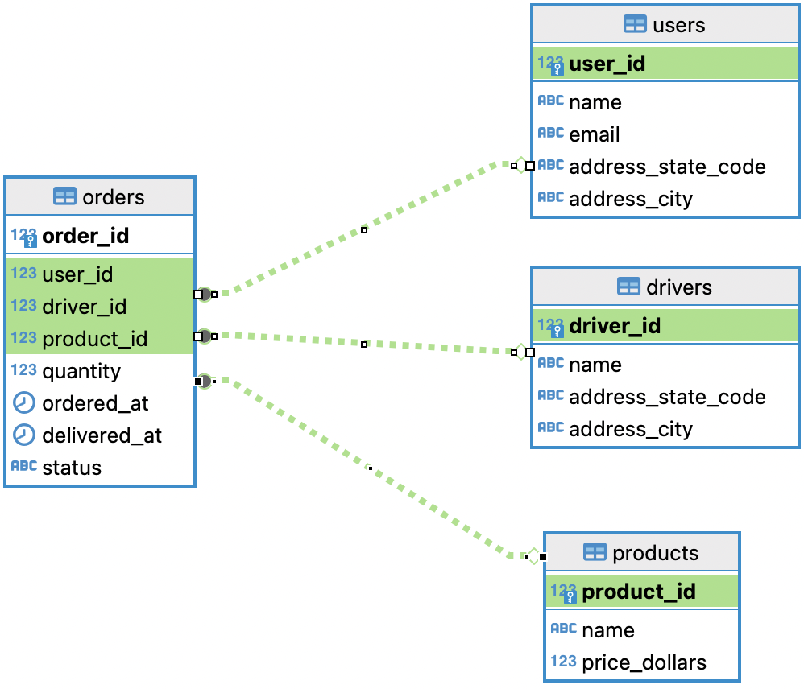

<h1 align="center">Curri Data Engineering Internship Take Home Assignment</h1>

<p align="center">
  <a href="" rel="noopener">
  </a>
</p>

<p align="center"> A take home assignment of SQL exercises for summer 2024 internship candidates </p>
    <br> 
</p>

## 📝 Table of Contents

* [📝 Table of Contents](#-table-of-contents-)
* [🧐 About](#-about-)
* [❗ Prerequisites](#-prerequisites-)
* [🧰 Setup](#-setup-)
* [🏁 Getting Started](#-getting-started-)
* [🚀 Submission](#-submission-)
* [🏋️ Exercises](#-exercises-)
* [🗂️ ERD](#-erd-)


## 🧐 About <a name = "about"></a>

This repository contains a take home assignment of SQL exercises for summer 2024 internship candidates. The assignment is divided into 2 parts:

1. SQL Exercises -- Write SQL queries to solve the exercises
2. SQL Theory -- Short answer theoretical questions about SQL and databases

The exercises are designed to test the candidate's SQL knowledge and problem solving skills. The candidate is expected to solve the exercises and submit the solutions in a SQL file.

## ❗ Prerequisites <a name = "prerequisites"></a>

Before you begin the setup section (below), you will need to have access to or create a new a GitHub account.

## 🧰 Setup <a name = "setup"></a>

To complete the assignment, you will need to have the following installed:
1. [Docker Desktop](https://www.docker.com/products/docker-desktop)
2. [DBeaver (Community/Open Source Version)](https://dbeaver.io/download/) (or another SQL client of your choice)
3. [Git](https://git-scm.com/downloads)


## 🏁 Getting Started <a name = "getting-started"></a>

### Step 1: Clone the Repository
Open your terminal and run the following command to clone the repository to your local machine:

```bash
git clone https://github.com/teamcurri/sql-exercises.git
```

### Step 2: Start the Database
Navigate to the repository directory (in the same terminal window)

```bash
cd sql-exercises
```

Run the following command to start the database:

```bash
docker-compose up -d
```

### Step 3: Connect to the Database
Open DBeaver (or another SQL client of your choice) and connect to the database using the following credentials:

```bash
host=localhost
port=5432
database=curri-practice-db
user=curri
```

### Step 4: Connecting to the Database and Writing Queries

Connecting to the Database:


https://github.com/teamcurri/sql-exercises/assets/62448274/619ff1d6-b701-4fc6-be07-e7dec3e7f66a


Writing Queries:


https://github.com/teamcurri/sql-exercises/assets/62448274/a29a4cfc-b216-4b55-98a4-859d8ee680d9


### Step 5: Complete the Exercises

Write out all of your SQL queries in a single file called `{first_name}_{last_name}_sql_exercise_submission.sql`. You can use DBeaver or another SQL client to write and execute/test your queries.

## 🚀 Submission <a name = "submission"></a>

To submit your solutions, send over the `{first_name}_{last_name}_sql_exercise_submission.sql` file as a DM in Slack to `@Nathan Jones`.

If you have any questions or need help with the assignment, please reach out in the #summer-2024-data-internship channel on Slack.

Good luck! 🚀

## 🏋️ Exercises <a name = "exercises"></a>

Question 1. List all orders with their associated product names.

Expected Output:

| First Header | Second Header |
| ------------ | ------------- |
| Content Cell | Content Cell  |
| Content Cell | Content Cell  |
| ...          | ...           |

Question 2. Find the total number of orders for each user.

Expected Output:

| First Header | Second Header |
| ------------ | ------------- |
| Content Cell | Content Cell  |
| Content Cell | Content Cell  |
| ...          | ...           |


Question 3. Calculate the revenue generated by each product and order the results by the product's with the highest total revenue.

Expected Output:

| First Header | Second Header |
| ------------ | ------------- |
| Content Cell | Content Cell  |
| Content Cell | Content Cell  |
| ...          | ...           |


Question 4. Identify drivers who have not completed any deliveries (i.e., none of their Orders were `Delivered`).

Expected Output:

| First Header | Second Header |
| ------------ | ------------- |
| Content Cell | Content Cell  |
| Content Cell | Content Cell  |
| ...          | ...           |

Question 5. List users along with the last product they ordered, including the order time.

Expected Output:

| First Header | Second Header |
| ------------ | ------------- |
| Content Cell | Content Cell  |
| Content Cell | Content Cell  |
| ...          | ...           |

Question 6. Calculate the average delivery time (in hours) for orders that have been delivered.

Expected Output:

| First Header | Second Header |
| ------------ | ------------- |
| Content Cell | Content Cell  |
| Content Cell | Content Cell  |
| ...          | ...           |

Question 7. Show the total orders and total pending orders for each city where drivers are based.

Expected Output:

| First Header | Second Header |
| ------------ | ------------- |
| Content Cell | Content Cell  |
| Content Cell | Content Cell  |
| ...          | ...           |


## 🗂️ ERD <a name = "erd"></a>

Here is the Entity Relationship Diagram (ERD) for the practice database. You can use this to understand the relationships between the tables and it will help you write your queries.



## 📝 TODO
- [ ] Add exercises to the README
  - Theoretical Questions
  - SQL Exercises
- [ ] Add more data to the practice database
- [ ] Add an ERD for the practice database
- [ ] Add `head()` of expected output for each exercise's solution
